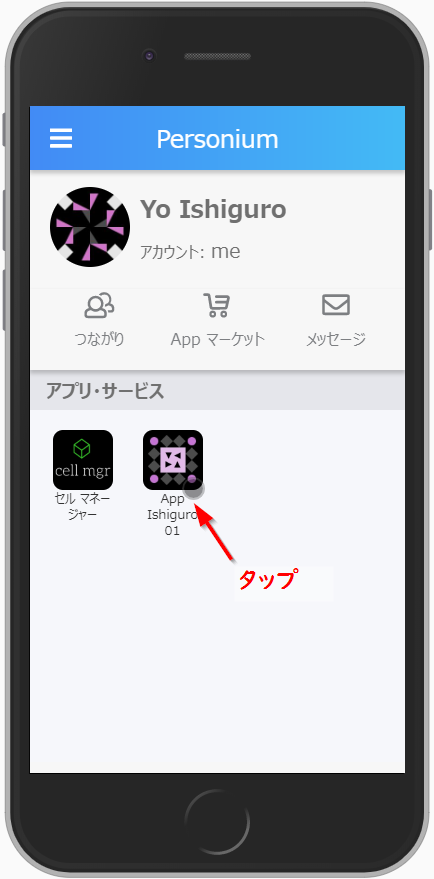
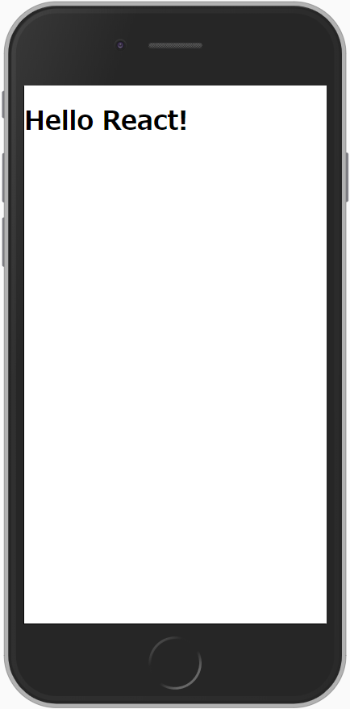

# personium-blank-app

This repository contains a template application of Personium and deployment tools.

| stuff                         | libraries    |
| :---------------------------- | :----------- |
| Personium template app        | React.js     |
| Personium app deployment tool | gulp, webdav |

You can make `Personium App` ( not `Apps that uses Personium` ) by extending these codes.

["Personium App" and "Apps that uses Personium"](https://personium.io/docs/en/app-developer/Personium_Apps/)

## Preaparation for deployment

### Update configurations

#### Config: Building and Deployment

Rename from `config.example.js` to `config.js` and modify it as below.

```js
module.exports = {
  personium: {
    CELL_NAME: "<CELL_NAME>", // A name of Application Cell
    CELL_FQDN: "<CELL_FQDN>", // FQDN of Application Cell
    CELL_ADMIN: "<ADMIN_USERNAME>", // Username of user with admin role.
    CELL_ADMIN_PASS: "<ADMIN_PASSWORD>", // Password of user with admin role.
    // ...
  },
};
```

- `<CELL_FQDN>` reveals application cell's FQDN ( like `app-template.demo.personium.io` )

#### Config: Application Cell

Rename from `src/assets/launch.example.json` to `src/assets/launch.json` and modify it as below.

```json
{
  "personal": {
    "web": "https://<CELL_FQDN>/__/front/app",
    "android": "***:",
    "ios": "***;"
  }
}
```

#### Config: Box in User Cell I

Rename from `src/bar/00_meta/00_manifest.example.json` to `src/bar/00_meta/00_manifest.json` and modify it as below.

```json
{
  "bar_version": "2",
  "box_version": "1",
  "default_path": "<DEFAULT_BOX_NAME>",
  "schema": "<CELL_URL>"
}
```

- `<DEFAULT_BOX_NAME>` reveals a name of Box created in User Cell when installation is done.
- `<CELL_URL>` reveals URL of App Cell ( scheme + `<CELL_FQDN>` + `/` ).

#### Config: Box in User Cell II

Rename from `src/bar/00_meta/90_rootprops.example.xml` to `src/bar/00_meta/90_rootprops.xml`. ( without modifing )

### Build

#### Building `bar` file

Build `bar` file with below command.

```bash
npm run build-bar
```

`bar` file contains structure of Application Box created in User Cell with installation.

This command generates `dist/<CELL_NAME>.bar`. You can install with this file from Home App Menu.

#### Building App

Build App with below command.

```bash
npm run build
```

This command build application into `build` folder.

### Deploy

#### Deploying built stuff

Upload built stuff ( Apps and static-files ) with below command.

```bash
npm run deploy
```

This command refers credentials in env value. Make sure below env value are set before try this code.

| ValueName        | Description                                     |
| :--------------- | :---------------------------------------------- |
| `PERSONIUM_USER` | Username of admin user in your application cell |
| `PERSONIUM_PASS` | Password of admin user in your application cell |

You can run this command with setting env value like below command.

In Linux,

```bash
PERSONIUM_USER=*** PERSONIUM_PASS=*** npm run deploy
```

In Windows,

```cmd
set PERSONIUM_USER=*** && set PERSONIUM_USER=*** && npm run deploy
```

#### Configure ACL

Configurign ACL is conducted manually.

1. Set `exec` to `all(anyone)` in `front` service.
1. Set `read` to `all(anyone)` in `public` folder.

#### Make application specs public

Set `read` to `all(anyone)` to below (4 files).

- launch.json
- profile.json
- relations.json
- roles.json

## Execute

In Home App of user who installs `bar` file above can launch this application by touching icon.





The entrypoint of this application is `src/app/frontend/index.js`.

```es6
import React from "react";
import ReactDOM from "react-dom";

ReactDOM.render(<h1>Hello React!</h1>, document.getElementById("root"));
```

So, you can implement SPA application with React.js by modifing this codes.
